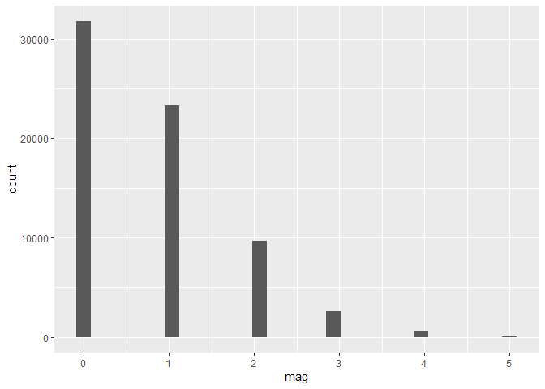

<!-- README.md is generated from README.Rmd. Please edit that file -->

# tornado

<!-- badges: start -->
<!-- badges: end -->

The goal of tornado is to load the data of tornadoes in United States in
1950-2022 and visualize with shiny. The package includes the tornado
dataset and a shiny app to visualize the data. The pkgdown site is
available
[here](https://etc5523-2024.assignment-4-packages-and-shiny-apps-joanna1016ma.tornado.org/)

## Installation

You can install the development version of tornado from
[GitHub](https://github.com/) with:

``` r
# install.packages("pak")
pak::pak("ETC5523-2024/assignment-4-packages-and-shiny-apps-joanna1016ma/tornado")

# or
# install.packages("devtools")
devtools::install_github("ETC5523-2024/assignment-4-packages-and-shiny-apps-joanna1016ma/tornado")
```

## Example

This is a basic example which shows you how to visualize the tornado
magnitude counts of each level:

``` r
library(tornado)
library(tidyverse)

## Histogram example
tornados |> 
  ggplot(aes(x = mag)) + 
  geom_histogram()
```


